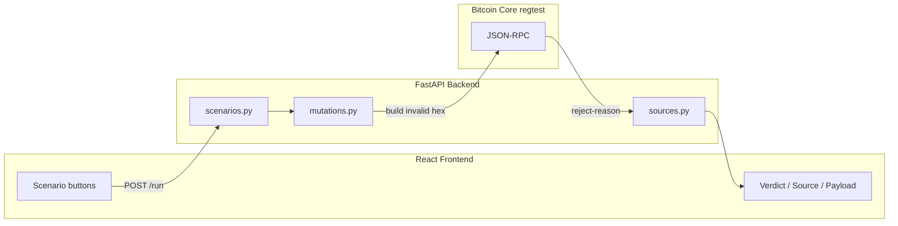

# What You Have Here

This is **My BTC Playground** (working title: Consensus Lab) — an educational sandbox that deliberately submits invalid Bitcoin blocks/transactions to a real Bitcoin Core node and shows you exactly how Core rejects them, including the C++ source code that fired.

The MVP is already built. You have three layers:



The whole trick: **validation without mutation**. You never broadcast anything or change the chain. You just ask Core "would you accept this?" and it answers.

---

## The Big Idea (One Sentence)

Pick a named attack → backend builds broken Bitcoin data → asks Core to validate it read-only → returns the raw hex, Core's rejection string, and a link to the C++ code that caught it.

---

## Project Layout

| Piece | What it does |
|---|---|
| [`regtest.conf`](regtest.conf) | Config for a local-only Bitcoin network |
| [`scripts/start_node.sh`](scripts/start_node.sh) | Starts `bitcoind` in regtest mode |
| [`backend/setup_chain.py`](backend/setup_chain.py) | Run once: mines blocks, creates test UTXOs, freezes the chain |
| [`backend/fixtures.json`](backend/fixtures.json) | Saved UTXO references + frozen chain tip (written by setup) |
| [`backend/node.py`](backend/node.py) | Thin wrapper to talk to Core over JSON-RPC |
| [`backend/mutations.py`](backend/mutations.py) | Builds each invalid payload (the "attacks") |
| [`backend/scenarios.py`](backend/scenarios.py) | Catalog of attacks — metadata only |
| [`backend/sources.py`](backend/sources.py) | Maps rejection strings → C++ source snippets |
| [`backend/main.py`](backend/main.py) | FastAPI: 2 endpoints (`GET /scenarios`, `POST /run`) |
| [`backend/vendor/test_framework/`](backend/vendor/test_framework/) | Copied from Bitcoin Core's own test suite for block building |
| [`frontend/src/App.jsx`](frontend/src/App.jsx) | Single-page UI: scenario list + three panes |
| [`plam.md`](plam.md) | The architecture doc / build plan (your north star) |

---

## What Happens When You Click a Scenario

Using **Coinbase Over-subsidy** as an example:

1. **Frontend** calls `POST /run` with `{ "scenario_id": "coinbase_oversubsidy" }`
2. **`main.py`** looks up the scenario in `scenarios.py`, calls the matching mutation function
3. **`mutations.py`** asks Core for a block template, builds a coinbase tx with 1 extra satoshi, serializes the block to hex
4. **`main.py`** submits that hex via `getblocktemplate` in **proposal mode**
5. Core returns `"bad-cb-amount"`
6. **`sources.py`** maps that string to the exact lines in `validation.cpp`
7. **Frontend** shows all three panes: verdict, C++ snippet, raw hex

The double-spend scenario is slightly different — it's submitted as a **block** (not just a tx) because that's what triggers the UTXO-set check that produces the right error. More on that below.

---

## Bitcoin Concepts You Need First

These aren't optional background — they're the vocabulary the code is written in.

### 1. Bitcoin Core (`bitcoind`)

The reference implementation of Bitcoin. It's a full node: it stores the blockchain, validates every block and transaction, and exposes a **JSON-RPC API** so other programs can talk to it.

Your app doesn't reimplement Bitcoin rules. It **delegates** to Core and reads the answer.

### 2. Regtest (Regression Test Network)

Bitcoin has three network modes:

- **Mainnet** — real Bitcoin, real money
- **Testnet** — public test network
- **Regtest** — your own private sandbox; you control block production entirely

You're on regtest. You can mine 120 blocks in seconds, create arbitrary UTXOs, and break rules without consequences. Addresses start with `bcrt1` (regtest bech32).

### 3. Blocks and Transactions

**Transaction (tx):** moves coins from inputs → outputs. Think of it as spending previous coins and creating new ones.

**Block:** a container of transactions, plus a header (prev block hash, merkle root, timestamp, etc.). Block #1 in every block is always the **coinbase** — the miner's reward.

```
Block
├── Header (hash, prevhash, merkle root, ...)
└── Transactions
    ├── [0] Coinbase (miner reward)
    ├── [1] Regular tx
    └── [2] Regular tx ...
```

### 4. UTXO Model

Bitcoin doesn't track "account balances." It tracks **Unspent Transaction Outputs (UTXOs)** — discrete chunks of coin sitting at specific `(txid, vout)` locations.

To spend 1 BTC, you reference an existing UTXO as an **input**, prove you own it (signature), and create new **outputs**.

Once a UTXO is spent, it's gone from the UTXO set forever. **Double-spending** = trying to spend the same UTXO twice. That's the attack your third scenario demonstrates.

### 5. Coinbase and Block Subsidy

Every block's first transaction pays the miner. The amount is:

```
block_reward = block_subsidy(height) + transaction_fees
```

The subsidy halves every ~4 years (currently 3.125 BTC on mainnet; much higher on regtest). If a coinbase pays **more** than allowed → `bad-cb-amount`. That's scenario #1.

### 6. Merkle Root

All transaction IDs in a block are hashed together into a single **merkle root** stored in the block header. This lets light clients verify a tx is in a block without downloading everything.

If you change a transaction but don't update the merkle root → `bad-txnmrklroot`. That's scenario #2.

### 7. Consensus Rules vs Policy Rules

This distinction matters and your app surfaces it:

| Type | Who enforces | Can a miner ignore it? |
|---|---|---|
| **Consensus** | Every node, always | No — block is invalid network-wide |
| **Policy** | Your node's mempool | Yes — a miner could include it in a block |

Examples:

- `bad-cb-amount` → **consensus** (every node rejects)
- `dust`, `min relay fee not met` → **policy** (your node won't relay it, but a miner could)

Your three MVP scenarios are all consensus violations.

### 8. Mempool vs Block Validation

- **Mempool** = pending transactions waiting to be mined
- **Block validation** = checking an entire block against the current chain state

Two different code paths in Core, which is why your project uses two different RPC calls (see below).

---

## The Two Key RPC Calls

These are the heart of the architecture from [`plam.md`](plam.md):

### `testmempoolaccept([raw_hex])`

"Would you put this transaction in your mempool?"

- Returns `{ allowed: true/false, reject-reason: "..." }`
- **Does not mutate anything** — no broadcast, no chain change
- Checks both consensus and policy rules

### `getblocktemplate({"mode": "proposal", "data": block_hex})`

"Is this block structurally valid (ignoring proof-of-work)?"

- Returns `null` if accepted, or a rejection string
- **PoW is not checked** — you never mine
- Block must build on the current tip (`prevhash` must match)

Block attacks use this. The double-spend uses it specifically because `testmempoolaccept` alone can't distinguish "UTXO never existed" from "UTXO already spent."

---

## Why the Chain Is "Frozen"

From [`setup_chain.py`](backend/setup_chain.py):

1. Mine 120 blocks (coinbase maturity is 100 blocks before you can spend coinbase rewards)
2. Create two fixture UTXOs:
   - **`spendable_a`** — normal, unspent coin
   - **`already_spent`** — a UTXO that was spent and that spend was mined into a block
3. Save everything to `fixtures.json`
4. **Never mine again**

Why freeze?

- Proposal-mode blocks must reference the current tip as `prevhash`
- Fixture UTXOs stay valid forever if nothing consumes them
- Multiple users can hit the same node concurrently without interfering

To reset: delete `.bitcoin-regtest/` and re-run setup.

---

## The Three Attacks (What Each One Actually Does)

### Coinbase Over-subsidy (`mutations.py`)

```python
coinbase.vout[0].nValue += 1  # 1 extra satoshi
```

Builds a block where the miner pays itself 1 sat more than allowed. Core checks this in `ConnectBlock`.

### Bad Merkle Root

```python
block.hashMerkleRoot ^= 1  # flip one bit
```

Block is otherwise valid, but the header's merkle root doesn't match the transactions. Cheap to detect, impossible to hide.

### Double Spend

1. Load the `already_spent` UTXO from fixtures (already consumed on-chain)
2. Build a new tx trying to spend it again
3. Sign it with the wallet
4. Wrap it in a block and submit as proposal

Core's UTXO set says "that output is gone" → `bad-txns-inputs-missingorspent`.

---

## The Vendored Test Framework

Building valid Bitcoin blocks by hand (coinbase format, merkle computation, witness commitments) is painful. So [`backend/vendor/`](backend/vendor/) contains files copied verbatim from Bitcoin Core's own functional test suite:

- `messages.py` — `CBlock`, `CTransaction`, serialization/deserialization
- `blocktools.py` — `create_block()`, `create_coinbase()`
- Plus dependencies (`script.py`, `key.py`, etc.)

Pinned to **Bitcoin Core v31.1** (see [`VENDORED.md`](backend/vendor/VENDORED.md)). Same version as your running `bitcoind`.

For **transactions**, the lighter path is used: let Core's wallet sign via `createrawtransaction` + `signrawtransactionwithwallet`, then mutate bytes in Python.

---

## The Source Mapping Layer

[`sources.py`](backend/sources.py) is hand-curated — not auto-generated. Each rejection string maps to:

- File + function + line numbers
- A pinned GitHub permalink (commit SHA, not branch — line numbers drift on `master`)
- The actual C++ snippet
- Whether it's consensus or policy

This is what makes the project distinctive: you see Core's *exact* words and *exact* code.

---

## Tools in Your Stack

| Tool | Role |
|---|---|
| **Bitcoin Core** (`bitcoind`, `bitcoin-cli`) | The validator — installed via Homebrew |
| **Python + FastAPI** | Backend API |
| **pytest** (`test_scenarios.py`) | Asserts live node still matches catalog |
| **React + Vite** | Frontend |
| **requests** | HTTP calls to Core's JSON-RPC |

To run locally (roughly):

```bash
./scripts/start_node.sh          # start node
python backend/setup_chain.py    # once, if no fixtures.json
uvicorn backend.main:app --reload
cd frontend && npm run dev
```

Or use `manual_check.py` to test mutations without the web UI.

---

## Mental Model Summary

```
You are NOT writing a Bitcoin validator.
You are NOT mining or broadcasting.
You ARE:
  1. Building deliberately broken Bitcoin data
  2. Asking Core "what would you do with this?"
  3. Showing the user Core's answer + where in the C++ that answer comes from
```

The frozen regtest chain is your test fixture. The scenario catalog is your curriculum. Core is the oracle.

---

## What to Read in What Order

If you're trying to understand the code:

1. [`projectidea.md`](projectidea.md) — the original pitch (2 min)
2. [`plam.md`](plam.md) sections 2–4 — the architectural constraints (10 min)
3. [`backend/scenarios.py`](backend/scenarios.py) — what attacks exist
4. [`backend/mutations.py`](backend/mutations.py) — how each attack is built
5. [`backend/main.py`](backend/main.py) — the 50-line glue
6. [`backend/sources.py`](backend/sources.py) — the C++ mappings
7. Run `python backend/manual_check.py` with the node up — see raw verdicts

If you want to go deeper on Bitcoin itself, the concepts above (UTXO model, consensus vs policy, coinbase, merkle root) are the minimum. Everything in the codebase assumes you know those.
